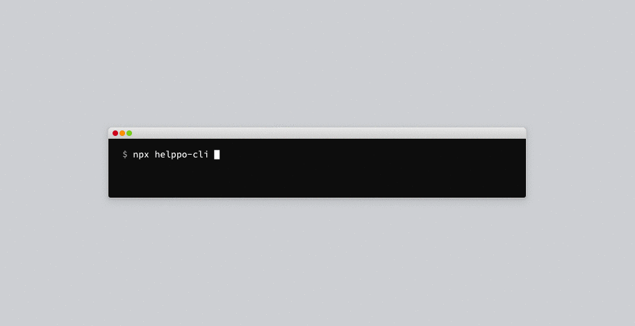
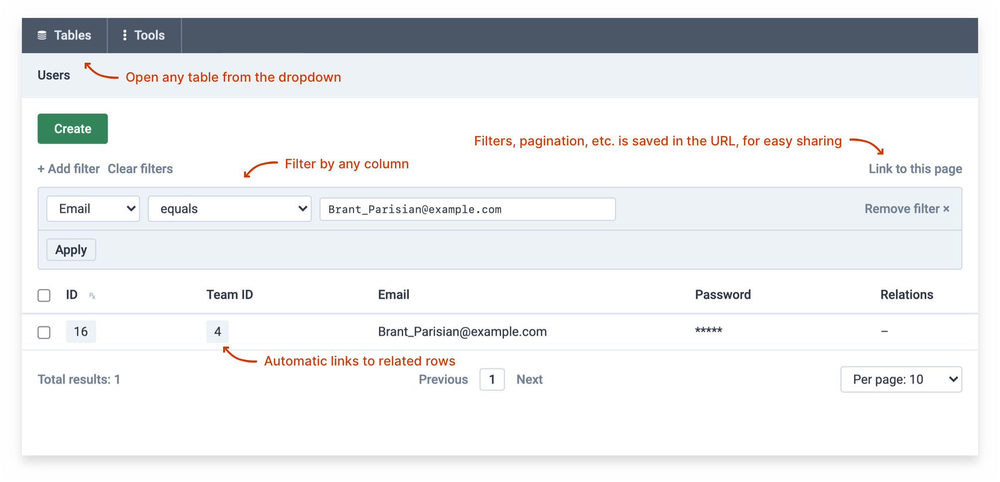
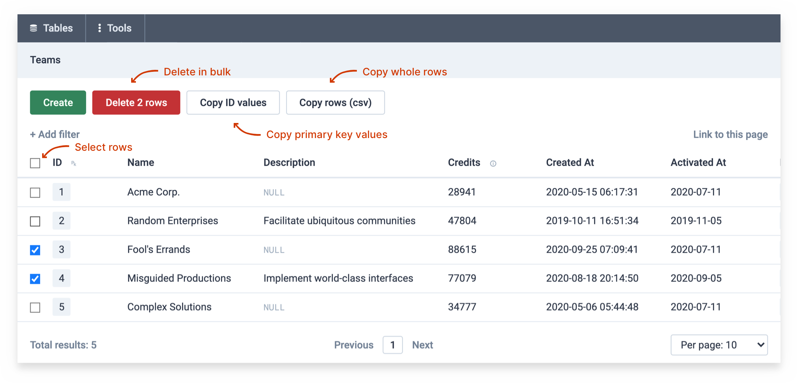
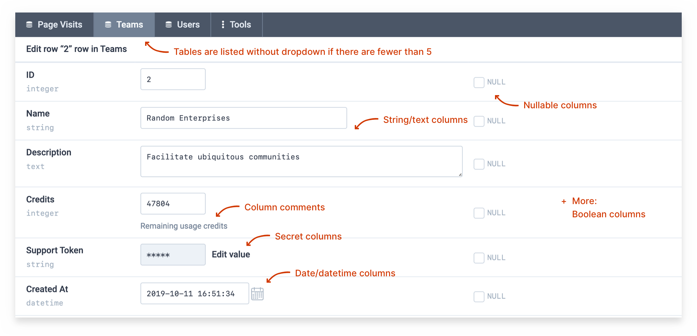
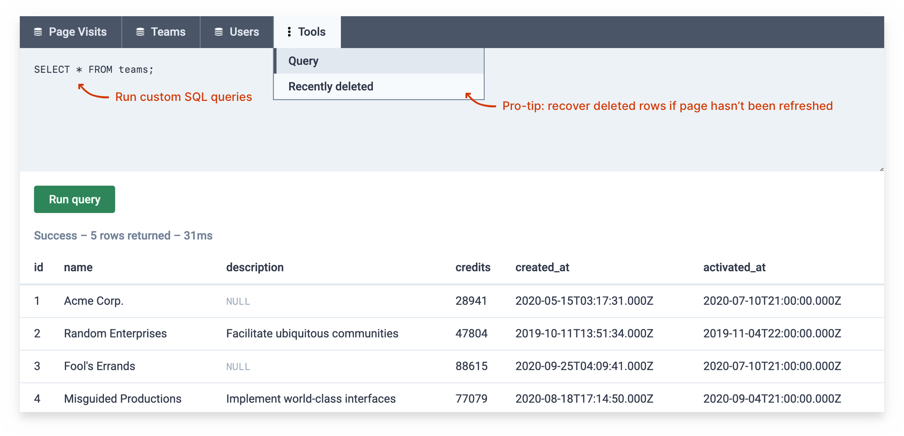

<p align="center">

</p>
<p align="center">
Instant database management interface in your browser
</p>
<p align="center">
<a href="https://github.com/codeclown/helppo"></a>
</p>
<p align="center">
<a href="#what-is-it">What is it</a>   
<a href="#screenshots">Screenshots</a>   
<a href="#subscribe-to-helppo-news">Mailing list</a>   
<a href="#license">License</a>
</p>
<p align="center">

</p>

## Quickstart

```bash
npm install -g helppo-cli
helppo-cli postgres://... # or mysql://...
```

## What is it

> Note: Helppo is still in early development.

Helppo is a **CLI tool** to _instantly_ (`helppo-cli <connection_string>`) spin up a graphical in-browser CRUD interface from a database connection string. Currently supported databases are Postgres and MySQL.

Helppo is also an **Express.js middleware**. In fact, the command-line interface is simply a wrapper around it. You can mount Helppo in your own Express-project.

See the documentation for each flavour:

- [**Command-Line Interface**](./docs/CLI.md)   [](https://www.npmjs.com/package/helppo-cli)
  <br>
  Instantly start a Helppo-instance from a connection string: `helppo-cli <connection_string>`

- [Express.js middleware](./docs/Middleware.md)   [](https://www.npmjs.com/package/helppo)<br>
  Mount a Helppo-instance in your own NodeJS application: `app.use(helppo())`

Also see [`docs/README.md`](./docs/README.md) for the remaining documentation.

### Feature highlights

- Automatically reads database schema (supports custom configuration), prints human-readable column names
- Browse tables with filters, pagination, foreign key links, bulk actions/copy
- Edit rows with the help of date pickers, secret columns
- Run raw SQL queries
- Recover deleted rows if you haven't refreshed the page
- Shareable URLs for every page, filter and query

### Screenshots

#### Browse database tables



#### Perform bulk actions



#### Edit database rows



#### Run raw SQL queries



## Subscribe to Helppo news

If you'd like to receive periodic updates about the status of Helppo, subscribe to the [mailing list](https://sunny-originator-7326.ck.page/bfe1f2d292).

## License

Versions 0.X of Helppo are published under the GPLv3 license.

Paraphrased, it means that you can use Helppo in any project for free, as long as you retain the license text in the source code (in the case of a server-side npm package like Helppo, this requirement is automatically fulfilled when installing it via npm, as the license text is always included in the node_modules subfolder). Additionally, if you modify Helppo itself and publish the modified software, it must be published under the same license.

For full license terms, see [LICENSE](./LICENSE).

### From v1.0 onwards

I plan on adding or changing to a commercial license from v1.0 onwards, if it seems sensible at that point (considering project traction, feature backlog, etc.). Versions that were released under GPL will of course remain available under GPL indefinitely. To keep up with the topic, subscribe to the [mailing list](https://sunny-originator-7326.ck.page/bfe1f2d292).

## Contributing

Please do file bug reports and feature requests as [issues](https://github.com/codeclown/helppo/issues) in this GitHub repository!

For more information, see [Contributing.md](./docs/Contributing.md).

---

**Helppo**   [CLI docs](./docs/CLI.md)   [Express.js middleware docs](./docs/Middleware.md)
