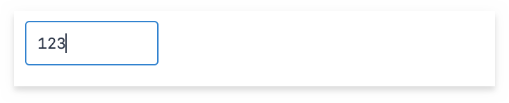
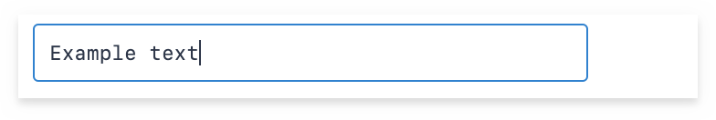
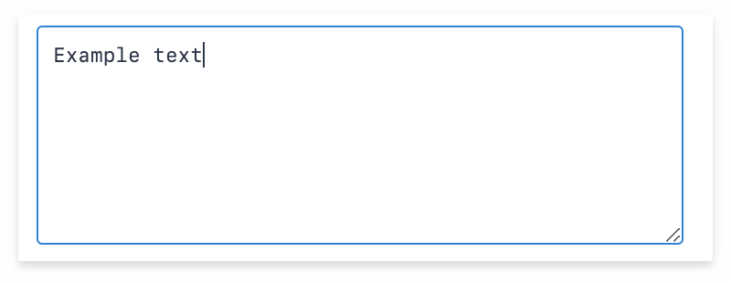
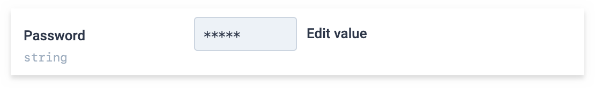
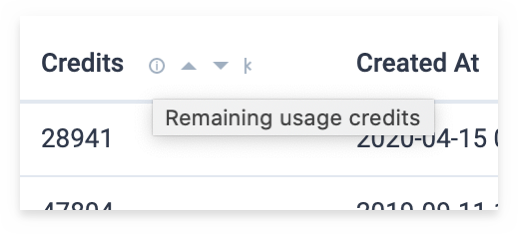

# Configuration

## Table of Contents

<!-- hohhoijaa -->

- [Table of Contents](#table-of-contents)
- [Options](#options)
  - [`driver`](#driver)
  - [`schema`](#schema)
- [Schema configuration](#schema-configuration)
  - [Table configuration](#table-configuration)
  - [Column configuration](#column-configuration)
- [Column types](#column-types)
  - [`integer`](#integer)
  - [`string`](#string)
  - [`text`](#text)
  - [`date`](#date)
  - [`datetime`](#datetime)
  - [`boolean`](#boolean)
- [Nullable columns](#nullable-columns)
- [Secret columns](#secret-columns)
- [Column comments](#column-comments)

<!-- /hohhoijaa -->

## Options

The following options are available.

### `driver`

Type: [Helppo driver](Drivers.md)

Example:

```js
{
  driver: new MysqlDriver(mysqlConnection);
}
```

### `schema`

Type: string or object

If set to `"auto"`, schema is deducted automatically by querying the database structure. Note that in this case all tables and columns are exposed in the Helppo UI, which may or may not be what you want.

If not, should be an object. See [Schema configuration](#schema-configuration).

Examples:

```js
{
  schema: "auto";
}
```

```js
{
  schema: {
    tables: [
      // ...
    ];
  }
}
```

## Schema configuration

Schema is configured as an object with the property `tables` which contains an array of table configurations.

Example configuration:

```js
{
  tables: [
    {
      name: "users",
      primaryKey: "id",
      columns: [
        {
          name: "id",
          type: "integer",
          autoIncrements: true,
        },
      ],
    },
  ];
}
```

Required properties for `schema`:

| key      | required | type  | description                                                                    |
| -------- | -------- | ----- | ------------------------------------------------------------------------------ |
| `tables` | Yes      | array | Array of table configurations, see [Table configuration](#table-configuration) |

### Table configuration

Required properties for tables:

| key       | required | type   | description                                                                       |
| --------- | -------- | ------ | --------------------------------------------------------------------------------- |
| `name`    | Yes      | string | Name of the table as it exists in the database                                    |
| `columns` | Yes      | array  | Array of column configurations, see [Column configuration](#column-configuration) |

Optional properties for tables:

| key          | required | type   | description                                                                                                               |
| ------------ | -------- | ------ | ------------------------------------------------------------------------------------------------------------------------- |
| `primaryKey` | No       | string | Name of the primary key column. If a table does not have a primary key, some features may be disabled (e.g. row editing). |

### Column configuration

Required properties for columns:

| key    | required | type   | description                                                        |
| ------ | -------- | ------ | ------------------------------------------------------------------ |
| `name` | Yes      | string | Name of the column as it exists in the database                    |
| `type` | Yes      | string | One of the available data types, see [Column types](#column-types) |

Optional properties for columns:

| key                | required | type    | default     | description                                                                                                              |
| ------------------ | -------- | ------- | ----------- | ------------------------------------------------------------------------------------------------------------------------ |
| `nullable`         | No       | boolean | `false`     | Is `NULL` an allowed column value. See [Nullable columns](#nullable-columns).                                            |
| `autoIncrements`   | No       | boolean | `false`     |                                                                                                                          |
| `referencesTable`  | No       | string  | `undefined` | If column references another table (i.e. foreign key), the applicable table name. Required if `referencesColumn` is set. |
| `referencesColumn` | No       | string  | `undefined` | If column references another table (i.e. foreign key), the applicable column name. Required if `referencesTable` is set. |
| `secret`           | No       | boolean | `false`     | Column value should not be viewable, only editable. See [Secret columns](#secret-columns).                               |
| `comment`          | No       | string  | `""`        | Define a text comment which is shown next to the column field when editing. See [Column comments](#column-comments).     |

In addition to these properties, some column types can include additional properties.

## Column types

The following column types are available.

- [`integer`](#integer)
- [`string`](#string)
- [`text`](#text)
- [`date`](#date)
- [`datetime`](#datetime)
- [`boolean`](#boolean)

### `integer`

Used for integer values.



### `string`

Used for values that are stored as single-line text.



Additional properties:

| key         | required | type    | default     | description            |
| ----------- | -------- | ------- | ----------- | ---------------------- |
| `maxLength` | No       | integer | `undefined` | Maximum allowed length |

### `text`

Used for values that are stored as multi-line text.



Additional properties:

| key         | required | type    | default     | description            |
| ----------- | -------- | ------- | ----------- | ---------------------- |
| `maxLength` | No       | integer | `undefined` | Maximum allowed length |

### `date`

Used for date values.


### `datetime`

Used for datetime values.


### `boolean`

Used for boolean values.


## Nullable columns

If `nullable` is true, a checkbox will appear next to the editor field, so the user can save `NULL` as the value.


This allows the explicit distinction between an empty string `""` and a `NULL` value.

## Secret columns

A column can be marked as secret:

```js
{
  name: 'password',
  type: 'string',
  secret: true
}
```

In this case its value is not viewable in the UI. By default an obfuscated field is shown:



After clicking **Edit value** user is able to set a new value to the field, without seeing the original:


Note that the value of a secret field is also not included in the AJAX responses sent to the client.

## Column comments

```js
{
  name: 'credits',
  type: 'integer',
  comment: 'Remaining usage credits'
}
```

If a column has a `comment` value, it is shown below the form input when editing a row:


The comment also becomes visible when browsing the table. It is shown as an info-icon with a tooltip:


