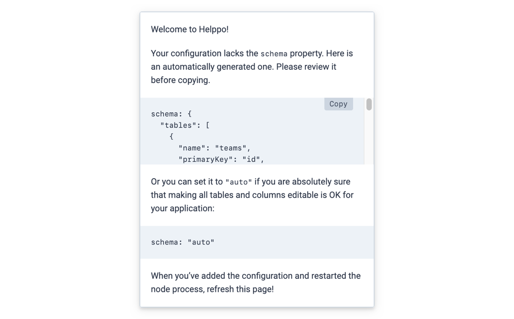

# Helppo Express.js middleware

> Mount a Helppo-instance in your own NodeJS application

<a href="https://www.npmjs.com/package/helppo"></a>

- Instant CRUD for your database (create, read, update, and delete)
- Works with Postgres, MySQL
- Can read database schema automatically, via [`schema: 'auto'`](./docs/Configuration.md#schema)
- **Just 2 dependencies (!!)**, you probably already have both (express and body-parser)
- Use your own authentication implementation

## Quickstart

Install Helppo as a dependency:

```shell
$ npm install --save helppo
# or
$ yarn add helppo
```

Mount it in your Express.js application:

```js
const config = {
  driver: ...,
  schema: ...,
};
app.use("/admin", helppo(config));
```

For more information, continue reading.

## Table of Contents

<!-- hohhoijaa -->

- [Quickstart](#quickstart)
- [Table of Contents](#table-of-contents)
- [Usage](#usage)
  - [Database driver](#database-driver)
  - [Schema](#schema)
    - [`schema: "auto"`](#schema-auto)
    - [`schema: { ... }`](#schema---)
  - [Customize column definitions](#customize-column-definitions)
- [Authentication](#authentication)
  - [Example: Basic Auth](#example-basic-auth)
  - [Example: Passport.js](#example-passportjs)
- [Documentation](#documentation)
- [License](#license)

<!-- /hohhoijaa -->

## Usage

### Database driver

Helppo works with your existing database connection. You don't pass database credentials to Helppo; instead you pass a _database driver_ which is initialized with your existing connection.

Example for Postgres:

```js
const { Client } = require('pg');
const connection = new Client(...);
app.use("/admin", helppo({
  driver: new helppo.drivers.PgDriver(connection),
}));
```

Example for MySQL:

```js
const mysql = require('mysql');
const connection = mysql.createConnection(...);
app.use("/admin", helppo({
  driver: new helppo.drivers.MysqlDriver(connection),
}));
```

See [`Drivers.md`](./Drivers.md#available-drivers) for a list of available drivers.

### Schema

#### `schema: "auto"`

Helppo can read your full database schema automatically.

Example:

```js
app.use("/admin", helppo({
  schema: "auto",
}));
```

#### `schema: { ... }`

For when you want to customize the table and column information (e.g. including only a subset of tables/columns), you can define a full schema-object.

Example:

```js
app.use("/admin", helppo({
  schema: {
    tables: [
      ...
    ]
  },
}));
```

**How to get a starting point?** Simply leave the `schema` property undefined in your config. When you open Helppo in your browser, you'll be able to copy an automatically generated schema:



See [`Configuration.md`](./Configuration.md#schema-configuration) for available schema configuration options.

### Customize column definitions

Take advantage of the various schema options Helppo supports:

- Set a maximum length for text-based columns (via `maxLength`)
- Hide the value of sensitive columns like passwords (via `secret`)
- Link related rows together between tables (via `referencesTable` and `referencesColumn`)
- Add a comment/explanation to a column (via `comment`)

For many of these, if you have them defined at the database level, Helppo will also find them automatically.

See [`Configuration.md`](./Configuration.md#schema-configuration) for documentation.

## Authentication

> **NOTE: Helppo does not include any built-in authentication.**

Helppo is a regular Express middleware, so you can restrict access to it similarly to any other middleware or route in your application.

The following examples are illustrative. Make sure to test your authentication implementation before going live.

### Example: Basic Auth

Example using the popular [`express-basic-auth`](https://www.npmjs.com/package/express-basic-auth) package:

```js
const basicAuth = require('express-basic-auth');
const authMiddeware = basicAuth({ ... });
app.use('/admin', authMiddeware, helppo(config));
```

### Example: Passport.js

If you use [`Passport.js`](https://www.npmjs.com/package/passport) in your application, just use it as usual:

```js
app.use("/admin", passport.authenticate("local"), helppo(config));
```

## Documentation

Full documentation can be found at [`docs/README.md`](./README.md).

## License

See [`LICENSE`](../LICENSE.md) in the repository root, and for added information see License-section in the repository [`README.md`](../README.md).
